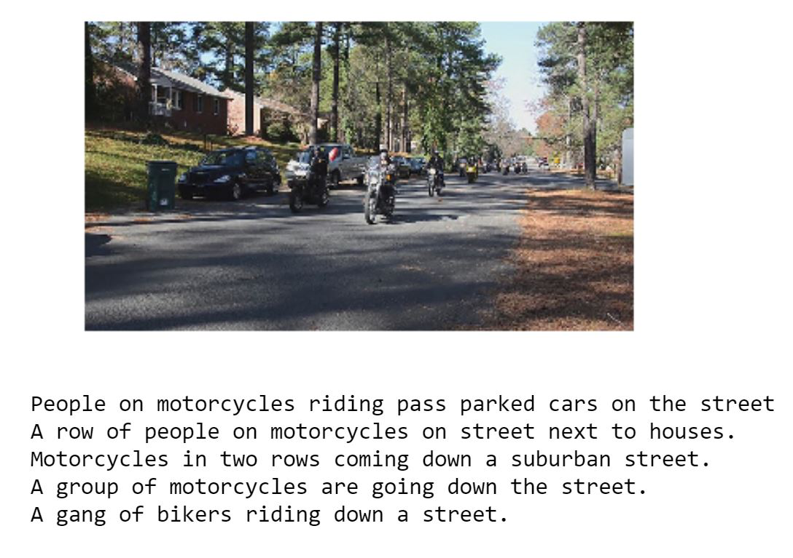
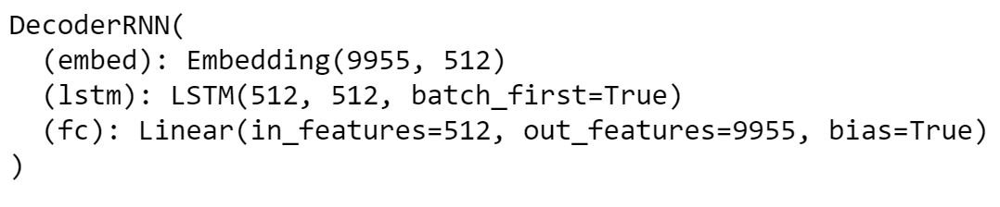
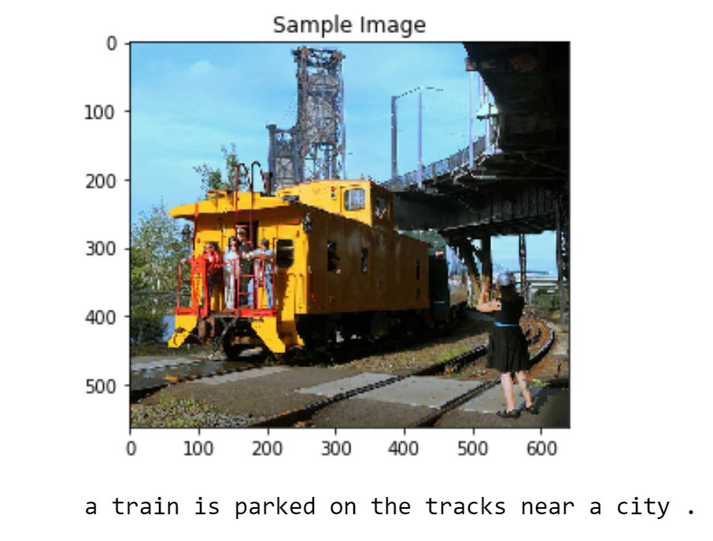
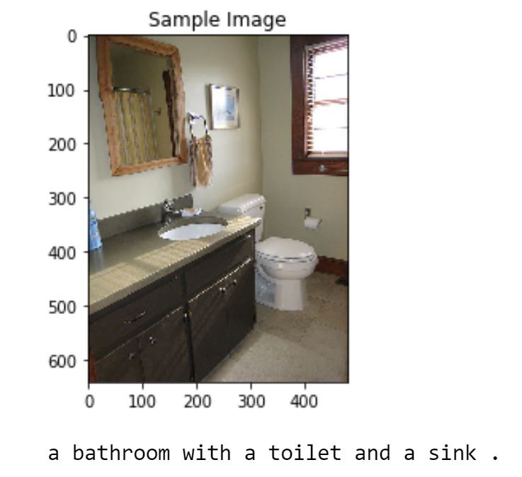
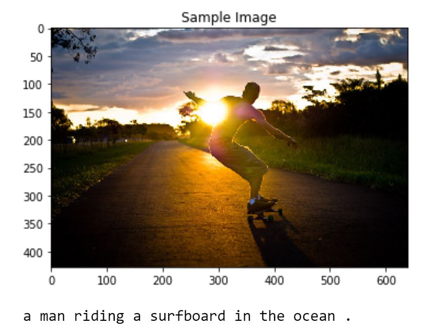

# Image Captioning Using CNN RNN Encoder Decoder Model


## Objective

In this project, I intend to generate captions for images in the COCO 2014 dataset using a Encoder-Decoder model.

## Project Walkthrough

### 1. Dataset Exploration and Transformation:

The Microsoft Common Objects in COntext (MS COCO) dataset is a large-scale dataset for scene understanding. The dataset is commonly used to train and benchmark object detection, segmentation, and captioning algorithms. Our task is image captioning hence we will only access the images and their respective captioins. Each image has 5 captions associated with it.


The COCO dataset is very rich in context and thus it is accessed by it's own API: `pycocotools`

Below, I have accessed and displayed an image along with the 5 captions:



#### Preparation Of Tokens:

A caption is converted to a list of tokens, with special start and end tokens marking the beginning and end of the sentence:
```
[<start>, 'a', 'person', 'doing', 'a', 'trick', 'while', 'riding', 'a', 'skateboard', '.', <end>]
```
This list of tokens is then turned into a list of integers, where every distinct word in the vocabulary has an associated integer value:
```
[0, 3, 98, 754, 3, 396, 207, 139, 3, 753, 18, 1]
```
Finally, this list is converted to a PyTorch tensor.

Next, I have initialzied a dictionary called as word2idx which is indexed by string-valued keys (mostly tokens obtained from training captions). For each key, the corresponding value is the integer that the token is mapped to.

The `word2idx` dictionary is created by looping over the captions in the training dataset.  If a token appears no less than `vocab_threshold` times in the training set, then it is added as a key to the dictionary and assigned a corresponding unique integer.

There are also a few special keys in the `word2idx` dictionary.  You are already familiar with the special start word (`"<start>"`) and special end word (`"<end>"`).  There is one more special token, corresponding to unknown words (`"<unk>"`).  All tokens that don't appear anywhere in the `word2idx` dictionary are considered unknown words. Any unknown tokens are mapped to the integer `2`.

### 2. Model Architecture and Training:

#### Encoder:

The encoder that I have used is the pre-trained ResNet-50 architecture (with the final fully-connected layer removed) to extract features from a batch of pre-processed images.  The output is then flattened to a vector, before being passed through a `Linear` layer to transform the feature vector to have the same size as the word embedding.


#### Decoder:

For the decoder, I have one LSTM layer which has a hidden size of 512.


Please see the `model.py` file and the `2_Training` notebook for details.

Final decoder architecture:




### 3. Inference:

Now I have loaded the test images and passed them through the trained model. The predictions done by the model are not always correct as I had expected them to be. Here are some of the examples:

Correct Predictions:





Incorrect Predictions:



### Conclusion:

Thus, I have successfully achieved the image captioning task by using an encoder-decoder architecture and have obtained pretty good results on the test set.